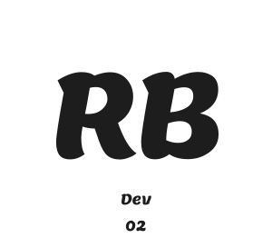

Este é o repositório do meu portfólio, desenvolvido com Astro, React e Tailwind CSS.

O objetivo deste projeto é me apresentar, exibir alguns dos meus trabalhos e compartilhar o processo de desenvolvimento, explicando as ideias por trás de cada projeto.

## Contato

Para qualquer dúvida ou sugestão, entre em contato através de:

- **Email:** <relancio.dev@gmail.com>
- **LinkedIn:** [Meu Linkedin](https://www.linkedin.com/in/relancioborges/)
- **Site:** [Meu Portfólio](https://relancioborgesdev.com/)

---

Obrigado por visitar meu portfólio!
