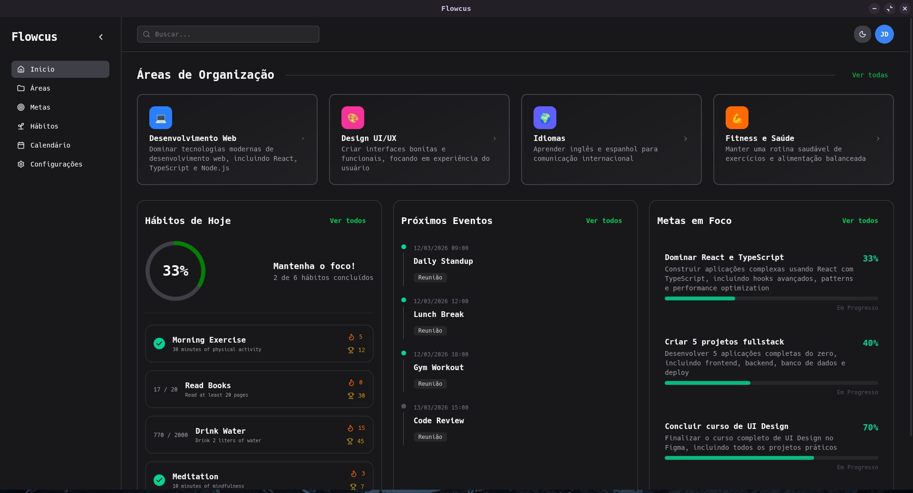
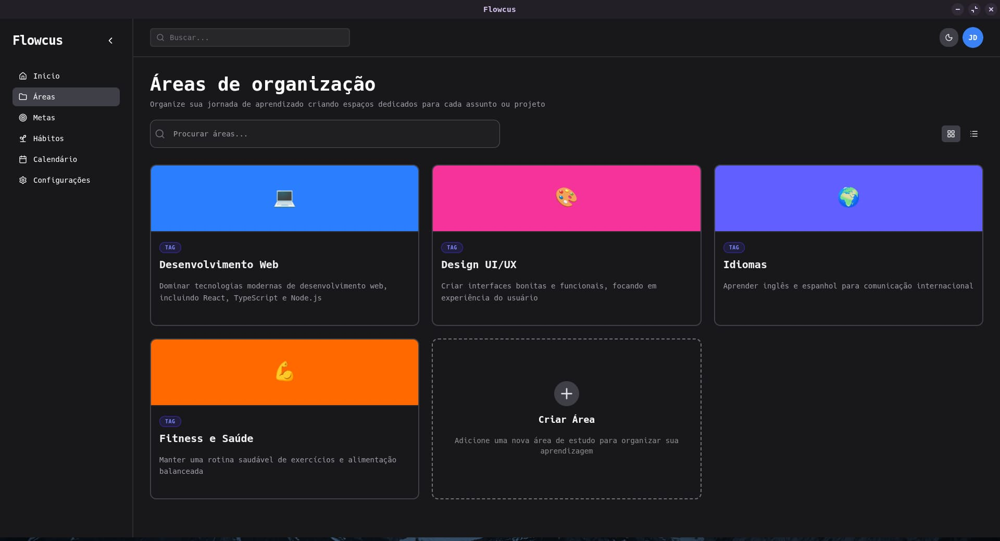
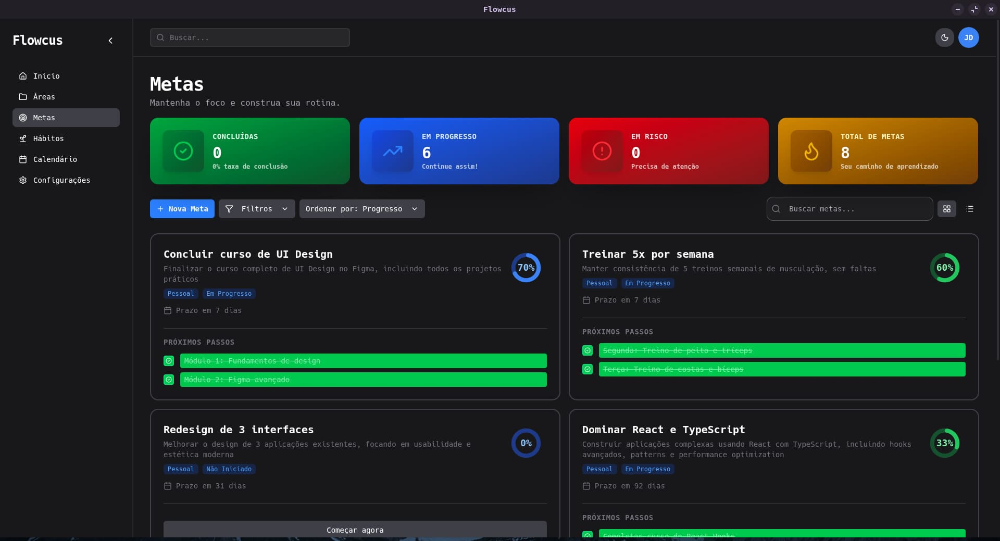
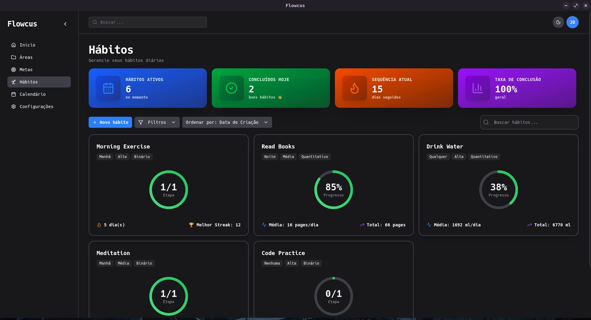
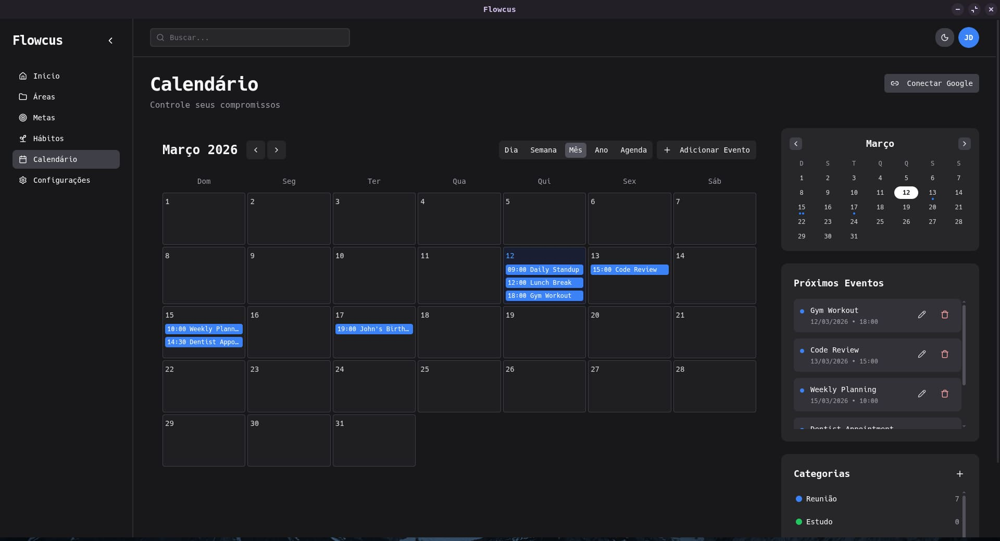
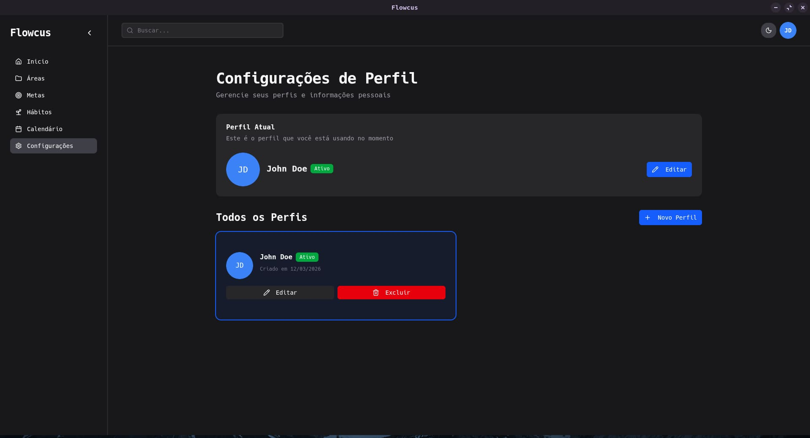

Uma aplicação desktop de produtividade construída com **Electron**, **React** e **TypeScript**, projetada para ajudar você a organizar sua vida profissional e pessoal através de quatro pilares principais: Áreas, Metas, Hábitos e Calendário.


Interface principal do Flowcus mostrando dashboard com áreas, metas, hábitos e calendário.

---

## 🎯 Por que criei este projeto?

Sempre gostei de ferramentas de produtividade, mas sentia que muitas das soluções existentes eram complexas demais ou simples demais para o que eu precisava no dia a dia. Por isso, decidi criar o Flowcus — uma aplicação que buscasse o equilíbrio entre ser completa o suficiente para organizar diferentes aspectos da vida e simples o bastante para ser realmente utilizada com frequência.

A ideia surgiu a partir de uma necessidade pessoal. Eu precisava de um software que me permitisse centralizar várias coisas em um único lugar: controle de hábitos, definição de metas, organização de compromissos em um calendário e também um espaço para escrever e manter meus textos de estudo.

Como não encontrei uma ferramenta que reunisse tudo isso da forma que eu queria, resolvi desenvolver a minha própria solução.

Outro objetivo importante era criar algo verdadeiramente offline-first, que funcionasse normalmente sem depender de conexão com a internet. Além disso, eu queria que a aplicação rodasse como um aplicativo desktop nativo, com boa performance e experiência fluida.

Para isso, escolhi utilizar Electron, que permite construir aplicações desktop usando tecnologias do ecossistema web, como React e TypeScript, mantendo uma experiência moderna e produtiva no desenvolvimento.

---

## 🧱 Arquitetura do Projeto

A arquitetura foi desenhada para ser escalável e de fácil manutenção, seguindo boas práticas de desenvolvimento moderno:

```
flowcus/
├── src/
│   ├── main/                    # Processo principal do Electron
│   │   ├── handles/             # Handlers IPC
│   │   │   ├── areas/           # CRUD de áreas
│   │   │   ├── goals/           # CRUD de metas + tarefas
│   │   │   ├── habits/          # CRUD de hábitos + logging
│   │   │   ├── calendar-events/ # CRUD de eventos
│   │   │   ├── blocks/          # Blocos de conteúdo
│   │   │   └── profile/         # Gerenciamento de perfis
│   │   └── db/                  # Banco de dados SQLite
│   │       ├── database.ts      # Configuração Drizzle
│   │       ├── schema.ts        # Definição de tabelas
│   │       └── seed/            # Dados iniciais
│   ├── preload/                 # Scripts de bridge segura
│   └── renderer/                # Processo UI (React)
│       └── src/
│           ├── components/      # Componentes reutilizáveis
│           ├── contexts/        # Estado global
│           ├── hooks/           # Hooks customizados
│           └── pages/           # Rotas da aplicação
```

### Decisões Arquiteturais

| Aspecto            | Decisão              | Motivo                                 |
| ------------------ | -------------------- | -------------------------------------- |
| **Banco de dados** | SQLite + Drizzle     | Performance offline, zero configuração |
| **Estado local**   | React Context        | Simplicidade, sem necessidade de Redux |
| **Estilização**    | Tailwind CSS 4       | DX rápido, utilities consistentes      |
| **Componentes**    | Radix UI + shadcn/ui | Acessibilidade pronta                  |
| **Build**          | Electron-Vite        | DX excelente, HMR rápido               |

<!-- IMG: Diagrama da arquitetura Electron (main/renderer/preload) -->

---

## ⚙️ Tecnologias e Ferramentas

### Stack Principal

- **Electron 38** – Framework desktop cross-platform
- **React 19** – Biblioteca de UI com Concurrent Mode
- **TypeScript 5.9** – Tipagem estática completa
- **Tailwind CSS 4** – Framework de estilização utilitário

### Banco de Dados

- **Drizzle ORM** – ORM leve e performático
- **Better-SQLite3** – Driver SQLite compilado para Node
- **SQLite** – Banco local, zero configuração

### UI/UX

- **Radix UI** – Primitivos de acessibilidade
- **shadcn/ui** – Componentes customizáveis
- **Lucide React** – Ícones consistentes
- **Framer Motion** – Animações fluidas
- **Tail Merge + CVA** – Utilitários de classe

### Editores de Texto

- **TipTap** – Editor headless e extensível
- **BlockNote** – Blocos estilo Notion
- **ProseMirror** – Motor do editor

### Visualização de Dados

- **Recharts** – Gráficos responsivos
- **React Day Picker** – Componente de calendário
- **date-fns + Luxon** – Manipulação de datas

### Build & Deploy

- **Electron-Vite** – Build tool otimizada
- **Electron Builder** – Empacotamento multi-plataforma

---

## 🚀 Funcionalidades

## 📁 Áreas

### Organize seus projetos e áreas de vida com um sistema flexível de blocos.


<figcaption>
Interface de áreas do Flowcus mostrando grid de áreas com cards coloridos.
</figcaption>

- **CRUD completo** – Crie, edite, delete e reordene áreas
- **Visualização dual** – Escolha entre grid ou lista
- **Drag & drop** – Reordene com arrasta e solta
- **Busca inteligente** – Filtre por nome ou descrição
- **Editor de blocos** – Conteúdo rico estilo Notion/Notepad++
- **Múltiplos formatos** – Suporte a texto, listas, código, imagens

## 🎯 Metas

### **Defina objetivos e acompanhe seu progresso com detalhamento granular.**


<figcaption>
Interface de metas do Flowcus mostrando card de meta com barra de progresso e tarefas.
</figcaption>

- **Hierarquia** – Metas contêm tarefas
- **Progresso automático** – Calculado baseado em tarefas concluídas
- **Categorias** – Organize por tipo (pessoal, trabalho, saúde...)
- **Prioridades** – Alta, média, baixa
- **Status flexíveis** – Em andamento, concluída, pausada, cancelada
- **Ordenação avançada** – Por data, prioridade, progresso

## 🌱 Hábitos

### Construa rotinas positivas com acompanhamento detalhado.


<figcaption>
Interface de hábitos do Flowcus mostrando dashboard com heatmap e estatísticas.
</figcaption>

- **Registro diário** – Marque como concluído/não concluído
- **Estreias (streaks)** – Sequência de dias consecutivos
- **Estatísticas completas**:
  - Taxa de conclusão
  - Melhor sequência
  - Histórico mensal
  - Heatmap anual
- **Tipos de hábito** – Rotina matutina, noturna, semanal
- **Filtros poderosos** – Por tipo, prioridade, status

## 📅 Calendário

### Gerencie eventos e compromissos com múltiplas visualizações.


<figcaption>
Interface de calendário do Flowcus mostrando calendário mensal com eventos coloridos por categoria.
</figcaption>

- **5 visualizações** – Dia, Semana, Mês, Ano, Agenda
- **Criação contextual** – Clique em qualquer dia/horário
- **Categorias** – Cores personalizadas para cada tipo
- **Mini calendário** – Navegação rápida independente
- **Eventos de dia todo** – Suporte completo
- **Recorrência** – Padrões repetitionais (em desenvolvimento)

### 🌍 Recursos Gerais


<figcaption>
Interface de configurações do Flowcus mostrando tema escuro e múltiplos perfis.
</figcaption>

- **Modo escuro** – Theme toggle automático e manual
- **Múltiplos perfis** – Troca entre diferentes usuários
- **Busca global** – Encontre qualquer item rapidamente
- **Design responsivo** – Funciona em mobile e tablet
- **Atalhos de teclado** – Navegação rápida via keyboard
- **Persistência local** – Dados salvos offline

---

## 🛠️ Desafios Técnicos

### 1. Sincronização de Estado

**Problema**: Como manter o estado consistente entre o processo principal (main) e o renderer?

**Solução**: Implementei um sistema de handlers IPC onde cada domínio (áreas, metas, hábitos) tem seus próprios handlers. O renderer envia mensagens via `ipcRenderer.invoke()` e o main process responde com os dados do banco.

```typescript
// Exemplo de handler IPC
ipcMain.handle("habits:getAll", async (_, profileId: string) => {
  return db.select().from(habits).where(eq(habits.profileId, profileId));
});
```

### 2. Performance com Grandes Dados

**Problema**: Renderizar listas grandes de hábitos e eventos causava lentidão.

**Solução**:

- Uso de `React.memo` em componentes de lista
- Virtualização onde necessário
- Queries otimizadas no Drizzle com filtros no banco

### 3. Editor de Blocos Estável

**Problema**: TipTap e BlockNote precisam funcionar bem em ambiente Electron.

**Solução**: Configuração customizada do editor com:

- Serialização adequada
- Persistência automática
- Suporte a diferentes tipos de bloco

### 4. Banco de Dados Local

**Problema**: Garantir que o SQLite funcione corretamente no Electron.

**Solução**:

- Wrapper `better-sqlite3` compilado para Electron
- Schema versionado com migrations
- Seed inicial para dados de exemplo

---

## 📚 O que Aprendi

Este projeto foi uma jornada de aprendizado intensa:

### Hard Skills

- **Electron** – Processos, IPC, preload, contextBridge
- **Drizzle ORM** – Queries, migrations, schema design
- **Tailwind CSS 4** – Novas features, utility classes
- **React 19** – Concurrent features, hooks
- **Build pipeline** – electron-vite, electron-builder

### Soft Skills

- **Planejamento de features** – Priorização e escopo
- **Arquitetura** – Decisões de design de longo prazo
- **UX** – Feedback visual, acessibilidade
- **Documentação** – READMEs claros para contribuição

---

## 🧪 Scripts Disponíveis

```bash
# Desenvolvimento
npm run dev              # Inicia em modo desenvolvimento
npm run start            # Preview da build

# Build
npm run build            # Compila TypeScript + Electron-Vite
npm run dist             # Gera instalador
npm run build:win       # Build para Windows
npm run build:mac       # Build para macOS
npm run build:linux     # Build para Linux

# Banco de Dados
npm run db:studio        # Abrir Drizzle Studio
npm run db:push         # Push schema para banco
npm run db:generate     # Gerar migrations
npm run db:migrate      # Rodar migrations
npm run db:seed         # Popular dados iniciais
npm run db:reset        # Reset completo do banco

# Qualidade
npm run lint            # Verificar código
npm run format          # Formatar código
npm run typecheck       # Verificar tipos TypeScript
```

---

## 🔮 Próximos Passos

O projeto ainda tem muito a evoluir. Algumas features planejadas:

- [ ] **Sincronização na nuvem** – Backup e sync entre dispositivos
- [ ] **Google Calendar** – Integração com GCal
- [ ] **Tags e labels** – Organização cruzada
- [ ] **Exportação** – PDF, Markdown, JSON
- [ ] **Plugins** – Sistema de extensões
- [ ] **PWA** – Versão web progressiva

---

## 💡 Por que este projeto importa

Este projeto demonstra minha capacidade de:

1. **Construir aplicações desktop completas** – Do zero até distribuição
2. **Trabalhar com stack moderno** – React, TypeScript, Electron
3. **Pensar em experiência do usuário** – UI/UX cuidadosamente trabalhada
4. **Resolver problemas complexos** – IPC, offline-first, performance
5. **Documentar e organizar** – Código limpo e bem estruturado

Flowcus não é apenas umgerenciador de tarefas — é uma prova de conceito de como criar ferramentas poderosas que rodam nativamente no desktop, offline, sem dependências externas.

<!-- IMG: Demonstração da aplicação em ação -->

---

**Gostou do projeto?** Entre em contato ou contribua no GitHub!

⭐ Star no repositório | 🍴 Fork | 📖 Documentação
