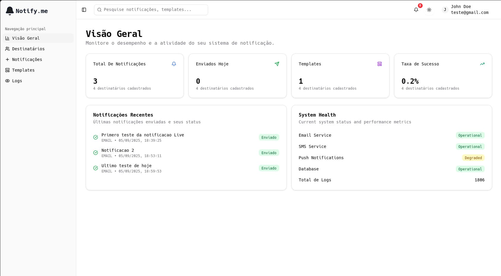
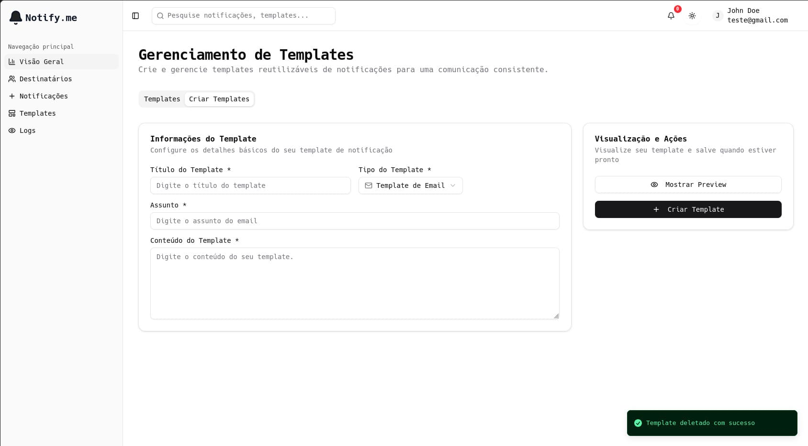
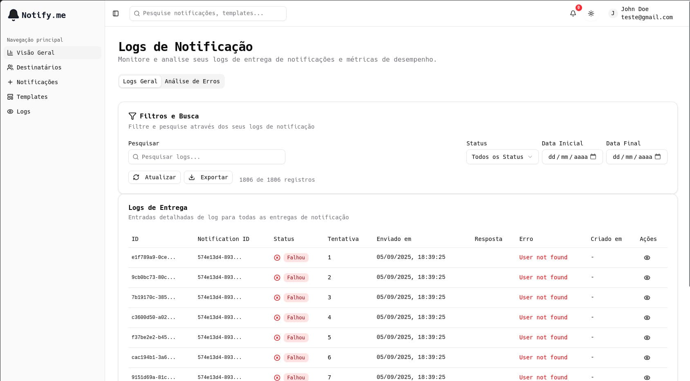

Um sistema completo de gerenciamento de notificações multicanal, construído com **NestJS** no backend e **React** no frontend. O projeto implementa uma arquitetura orientada a eventos com RabbitMQ para processamento assíncrono, suportando envio por email, SMS e push com lógica de priorização, agendamento e retry automático.


<figcaption>
Dashboard principal com visão geral das notificações, status e métricas de entrega.
</figcaption>


<figcaption>
Interface de templates reutilizáveis com suporte a múltiplos canais de envio.
</figcaption>


<figcaption>
Auditoria completa com logs de entrega, status e tentativas de reenvio.
</figcaption>

---

## Por que criei este projeto?

Sistemas de notificação estão no centro de qualquer aplicação SaaS moderna. Desde emails transacionais até alertas em tempo real, uma infraestrutura robusta de notificações é essencial. Decidi construir o Notify Me para dominar:

- **Arquitetura orientada a eventos** – Processamento assíncrono com filas de mensagens
- **Multicanal** – Integração de email, SMS e push notifications
- **Resiliência** – Retry automático, dead letter queue, tratamento de falhas
- **Agendamento** – Notificações programadas para entrega futura
- **Clean Architecture** – Separação de responsabilidades com NestJS
- **Auditoria** – Rastreamento completo do ciclo de vida de cada notificação

Escolhi NestJS pela arquitetura modular e opinionada, Prisma ORM pela produtividade com TypeScript, e RabbitMQ pela confiabilidade no processamento de filas.

---

## Arquitetura do Projeto

A arquitetura segue os princípios da **Clean Architecture**, organizada em três camadas principais:

```
notify-full/
├── notify-system/                # NestJS Backend
│   ├── prisma/                   # Schema, migrations, ERD
│   ├── src/
│   │   ├── core/                 # Entidades base e interfaces
│   │   │   ├── entities/         # Entidades de domínio
│   │   │   ├── cryptography/     # Interfaces de criptografia
│   │   │   └── types/            # Tipos compartilhados
│   │   │
│   │   ├── domain/               # Casos de uso e regras de negócio
│   │   │   ├── notification/     # Notificações, templates, logs
│   │   │   ├── recipients/       # Gerenciamento de destinatários
│   │   │   └── users/            # Autenticação e usuários
│   │   │
│   │   ├── infra/                # Infraestrutura
│   │   │   ├── http/             # Controladores REST
│   │   │   ├── auth/             # JWT, Passport, guards
│   │   │   ├── database/         # PrismaService, repositórios
│   │   │   ├── queues/           # RabbitMQ producers/consumers
│   │   │   ├── mail/             # Nodemailer
│   │   │   ├── env/              # Variáveis de ambiente
│   │   │   └── main.ts           # Entry point
│   │   │
│   │   └── app.module.ts         # Módulo raiz
│   │
│   ├── docker-compose.yml        # PostgreSQL + RabbitMQ
│   └── test/                     # Testes unitários e E2E
│
└── notify-frontend/              # React SPA
    ├── src/
    │   ├── components/           # shadcn/ui components
    │   ├── pages/                # Rotas da aplicação
    │   ├── http/                 # Client HTTP + tipos
    │   ├── hooks/                # Custom hooks
    │   ├── layouts/              # Dashboard layout
    │   └── lib/                  # Utilitários
    └── vite.config.ts
```

### Fluxo de Dados

```
┌─────────────┐     ┌──────────────┐     ┌─────────────────┐
│   Frontend  │────▶│   NestJS     │────▶│   PostgreSQL    │
│   (React)   │     │    API       │     │   (Prisma)      │
└─────────────┘     └──────┬───────┘     └─────────────────┘
                           │
                           ▼
                  ┌────────────────┐
                  │   RabbitMQ     │
                  │  (Queue)      │
                  └───────┬────────┘
                          │
                          ▼
                  ┌────────────────┐
                  │   Consumer     │
                  │ (Worker)      │
                  └───────┬────────┘
                          │
                          ▼
          ┌───────────────┼───────────────┐
          ▼               ▼               ▼
    ┌──────────┐   ┌──────────┐   ┌──────────┐
    │  Email   │   │   SMS    │   │   Push   │
    │(SMTP)    │   │(Provider)│   │ (FCM/APN)│
    └──────────┘   └──────────┘   └──────────┘
          │               │               │
          └───────────────┼───────────────┘
                          ▼
                  ┌────────────────┐
                  │   Audit Log    │
                  │  (PostgreSQL) │
                  └────────────────┘
```

### Decisões Arquiteturais

| Aspecto             | Decisão              | Motivo                             |
| ------------------- | -------------------- | ---------------------------------- |
| **Backend**         | NestJS 11            | Modular, opinionado, decorators    |
| **Frontend**        | React 19 + Vite      | Performance e developer experience |
| **Estilização**     | Tailwind CSS 4       | Utilitário, produtivo              |
| **Componentes**     | shadcn/ui + Radix    | Acessibilidade, customizável       |
| **Banco de dados**  | PostgreSQL + Prisma  | Type-safe, migrations produtivas   |
| **Fila de msgs**    | RabbitMQ             | Confiabilidade, AMQP padrão        |
| **Autenticação**    | JWT RS256 + Passport | Segurança, stateless               |
| **Validação**       | Zod                  | TypeScript-first, schemas robustos |
| **Estado frontend** | TanStack Query       | Cache, refetch, devtools           |

---

## Tecnologias e Ferramentas

### Stack Principal

- **Node.js 22** – Runtime JavaScript
- **TypeScript 5.x** – Tipagem estática completa
- **NestJS 11** – Framework Node.js modular

### Frontend

- **React 19** – Biblioteca UI
- **Vite 7** – Build tool moderno
- **Tailwind CSS 4** – Framework CSS utilitário
- **React Router 7** – Roteamento SPA
- **TanStack Query 5** – Gerenciamento de estado servidor
- **TanStack Table 8** – Tabelas de dados performáticas
- **shadcn/ui** – Componentes acessíveis e estilizados
- **Lucide React** – Ícones
- **react-hook-form** – Formulários performáticos
- **Sonner** – Toast notifications
- **next-themes** – Dark/light mode

### Backend

- **NestJS** – Framework web modular
- **Prisma ORM** – ORM type-safe com migrations
- **PostgreSQL** – Banco de dados relacional
- **RabbitMQ (amqplib)** – Message broker
- **Nodemailer** – Envio de email (SMTP)
- **Passport + JWT** – Autenticação segura
- **Zod** – Validação de schemas
- **Swagger + Scalar** – Documentação de API

### Infraestrutura

- **Docker** – Containerização
- **Docker Compose** – Orquestração local
- **PostgreSQL 16** – Banco de dados
- **RabbitMQ 3** – Fila de mensagens

---

## Funcionalidades

### Funcionalidades Principais

- **Notificações Multicanal** – Email, SMS e Push notifications
- **Agendamento** – Programe notificações para entrega futura
- **Templates Reutilizáveis** – Templates com subject/body por canal
- **Priorização** – Filas com prioridade para notificações urgentes
- **Retry Automático** – Tentativas de reenvio com backoff exponencial
- **Dead Letter Queue** – Mensagens com falha após máximo de tentativas
- **Auditoria Completa** – Logs de entrega com sucesso/falha
- **Gerenciamento de Destinatários** – CRUD, importação em massa
- **Autenticação JWT** – Login/register com sessão segura
- **Tema Dark/Light** – Alternância built-in com next-themes
- **Documentação da API** – Swagger UI + Scalar API Reference

### Sistema de Filas

O sistema utiliza RabbitMQ com três estratégias de fila:

- **notifications** – Fila principal de processamento
- **notifications_priority** – Fila de alta prioridade
- **notifications_dlq** – Dead letter queue para falhas

### Ciclo de Vida de uma Notificação

1. Usuário cria notificação via API ou dashboard
2. Notificação salva no PostgreSQL com status `PENDING`
3. Mensagem publicada na fila RabbitMQ
4. Consumer coleta a mensagem e processa
5. Envio via canal apropriado (email/SMS/push)
6. Status atualizado para `SENT` ou `FAILED`
7. Log de entrega registrado para auditoria
8. Se falhou → retry até limite → DLQ

---

## Desafios Técnicos

### 1. Processamento Assíncrono com RabbitMQ

**Problema**: Garantir que notificações sejam processadas de forma confiável, com suporte a prioridade e retry.

**Solução**: Implementei producers e consumers utilizando amqplib, com filas dedicadas e dead letter queue para mensagens com falha.

```typescript
@Injectable()
export class NotificationsConsumer {
  @RabbitSubscribe({
    exchange: "notify.exchange",
    routingKey: "notification.created",
    queue: "notifications",
  })
  async handleNotification(msg: NotificationMessage) {
    const result = await this.sendNotification(msg);
    if (!result.success) {
      await this.retryOrDeadLetter(msg);
    }
  }
}
```

### 2. Clean Architecture com NestJS

**Problema**: Organizar o código de forma que regras de negócio fiquem isoladas de infraestrutura.

**Solução**: Separei o projeto em três camadas — `core` (entidades), `domain` (use cases) e `infra` (implementações concretas) — com inversão de dependência via interfaces.

```typescript
// Camada core - interface
export abstract class NotificationsRepository {
  abstract create(notification: Notification): Promise<void>;
  abstract findById(id: string): Promise<Notification | null>;
}

// Camada infra - implementação
@Injectable()
export class PrismaNotificationsRepository extends NotificationsRepository {
  constructor(private prisma: PrismaService) {}
  async create(notification: Notification) {
    await this.prisma.notification.create({ data: notification });
  }
}
```

### 3. Tabelas Performáticas com TanStack Table

**Problema**: Renderizar grandes volumes de logs de notificação sem degradação.

**Solução**: Utilizei TanStack Table com paginação server-side, sorting e filtros, reduzindo drasticamente os dados trafegados.

### 4. Autenticação com JWT RS256

**Problema**: Garantir autenticação segura sem expor segredos no cliente.

**Solução**: Implementei JWT com par de chaves RSA (pública/privada) via Passport, com cookies HTTP-only para refresh tokens.

---

## O que Aprendi

Este projeto foi uma jornada intensa de aprendizado:

### Hard Skills

- **NestJS** – Módulos, injetores, guards, interceptors
- **Prisma ORM** – Schema design, migrations, queries
- **React 19** – Server components, hooks, TanStack Query
- **Tailwind CSS 4** – Utility-first, dark mode com next-themes
- **RabbitMQ** – Filas, exchanges, routing keys, DLQ
- **Clean Architecture** – Separação de camadas, DI
- **JWT RS256** – Autenticação assimétrica segura
- **Docker Compose** – Multi-container orchestration
- **shadcn/ui** – Componentes acessíveis e customizáveis

### Soft Skills

- **Arquitetura orientada a eventos** – Design de sistemas assíncronos
- **Resiliência** – Retry strategies, error handling
- **Documentação de APIs** – Swagger/OpenAPI + Scalar
- **Testes** – Testes unitários e E2E com Jest

---

## Endpoints da API

```bash
# Autenticação
POST /auth/register        # Registrar novo usuário
POST /auth/login           # Login
POST /auth/logout          # Logout

# Notificações
GET  /notifications        # Listar notificações
POST /notifications        # Criar notificação
DELETE /notifications/:id  # Remover notificação

# Templates
GET  /templates            # Listar templates
POST /templates            # Criar template
GET  /templates/:id        # Detalhes do template
PUT  /templates/:id        # Atualizar template
DELETE /templates/:id      # Remover template

# Destinatários
GET  /recipients           # Listar destinatários
POST /recipients           # Criar destinatário
PUT  /recipients/:id       # Atualizar destinatário
DELETE /recipients/:id     # Remover destinatário

# Logs
GET  /notification-logs    # Logs de entrega

# Perfil
GET  /me                   # Dados do usuário logado
```

---

## Scripts Disponíveis

### Backend

```bash
# Desenvolvimento
cd notify-system
npm run start:dev        # Inicia servidor em watch mode
npm run start:prod       # Inicia em produção

# Build
npm run build            # Compila TypeScript

# Database
npx prisma migrate dev   # Rodar migrations
npx prisma generate      # Gerar client Prisma
npx prisma studio        # GUI do banco (porta 5555)

# Testes
npm run test             # Testes unitários
npm run test:e2e         # Testes E2E
npm run test:cov         # Cobertura de testes
```

### Frontend

```bash
# Desenvolvimento
cd notify-frontend
npm run dev              # Inicia Vite (porta 5173)

# Build
npm run build            # Compila para produção
npm run preview          # Preview do build
```

### Docker

```bash
# Iniciar infraestrutura
cd notify-system
docker-compose up -d     # PostgreSQL + RabbitMQ

# Ver logs
docker-compose logs -f   # Logs dos containers
```

---

## Por que este projeto importa

Este projeto demonstra minha capacidade de:

1. **Arquitetura limpa e modular** – Código organizado com NestJS + Clean Architecture
2. **Sistemas orientados a eventos** – RabbitMQ para processamento assíncrono robusto
3. **Full-stack moderno** – React + NestJS com TypeScript end-to-end
4. **Resiliência** – Retry, DLQ, tratamento de falhas
5. **Experiência do usuário** – Dashboard completo com TanStack Table + shadcn/ui

Notify Me não é apenas um sistema de notificações — é uma prova de conceito de como construir aplicações SaaS escaláveis e resilientes com Node.js.

---

**Gostou do projeto?** Entre em contato ou contribua no GitHub!

⭐ Star no repositório | 🍴 Fork | 📖 Documentação
