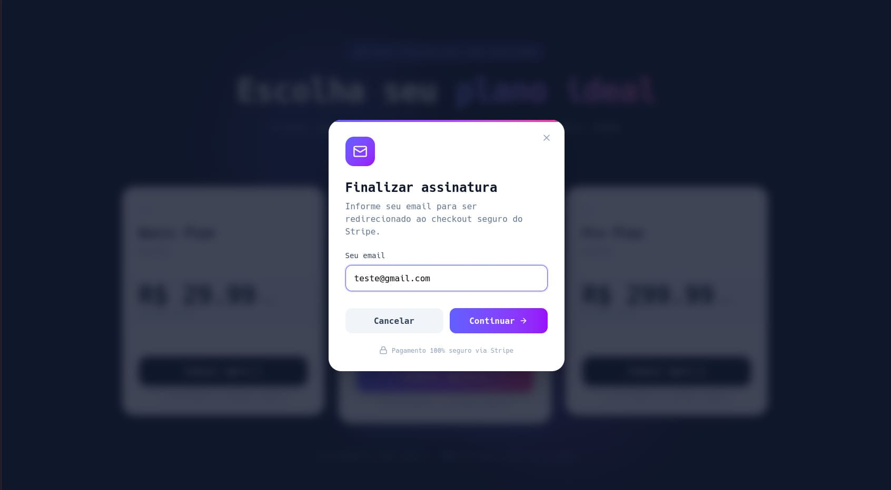
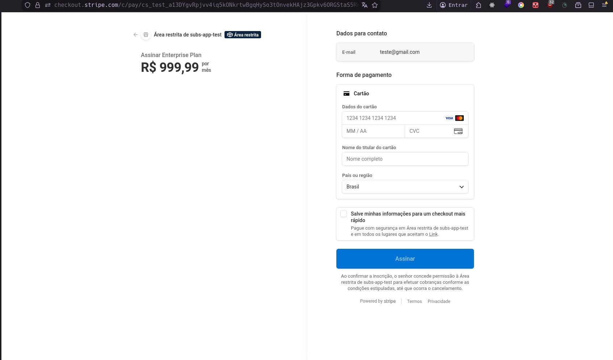
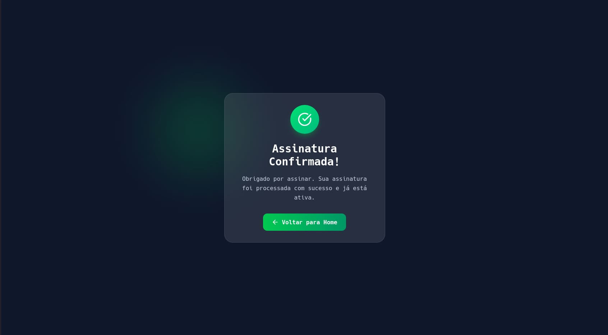

Um sistema completo de gerenciamento de assinaturas para SaaS, construído com **Fastify** no backend e **React** no frontend. O projeto implementa uma arquitetura orientada a eventos utilizando RabbitMQ para processamento assíncrono, com integração completa ao Stripe para cobranças recorrentes.


<figcaption>
Interface onde o usuário informa o seu email para finalizar o cadastro da assinatura.
</figcaption>


<figcaption>
Tela de checkout do Stripe, onde o usuário informa os dados do cartão para finalizar o pagamento.
</figcaption>


<figcaption>
Exibe a confirmação do registro após a criação da assinatura no sistema.
</figcaption>

---

## Por que criei este projeto?

Sempre quis entender profundamente como sistemas de assinatura funcionam nos bastidores. Plataformas como Netflix, Spotify e serviços SaaS dependem de sistemas robustos de cobrança recorrente, e decidi criar o meu próprio para aprender:

- **Cobrança recorrente** – Como funciona o ciclo de pagamento automatizado
- **Webhooks** – Processamento de eventos de pagamento em tempo real
- **Arquitetura orientada a eventos** – Utilização de filas de mensagens para desacoplamento
- **Integração com Stripe** – A plataforma mais utilizada para pagamentos online
- **Clean Architecture** – Separação de responsabilidades no backend

Escolhi Fastify pela performance superior ao Express, React com Tailwind para o frontend moderno e rápido, e RabbitMQ para o sistema de mensagens assíncronas.

---

## Arquitetura do Projeto

A arquitetura segue os princípios da **Clean Architecture** e é organizada em duas aplicações distintas:

```
subs-app/
├── back/                          # Backend API
│   ├── src/
│   │   ├── database/              # Camada de dados
│   │   │   ├── repositories/      # Implementações de repositório
│   │   │   ├── schema.ts          # Schema Drizzle
│   │   │   └── client.ts          # Cliente PostgreSQL
│   │   │
│   │   ├── http/                  # Camada HTTP
│   │   │   ├── controllers/       # Controladores Fastify
│   │   │   ├── routes/            # Definições de rotas
│   │   │   ├── server.ts          # Ponto de entrada
│   │   │   └── stripe/            # Integração Stripe
│   │   │
│   │   ├── services/              # Camada de serviços
│   │   ├── interfaces/            # Interfaces de repositório
│   │   ├── workers/               # Processadores de fila
│   │   ├── libs/                  # Bibliotecas
│   │   │   ├── amqp/              # RabbitMQ
│   │   │   └── stripe.ts          # Cliente Stripe
│   │   ├── env/                   # Configuração
│   │   └── scripts/               # Scripts utilitários
│   │
│   └── docker-compose.yml         # Infraestrutura
│
└── front/                         # Frontend React
    ├── src/
    │   ├── components/            # Componentes React
    │   │   ├── plan-card.tsx       # Card de plano
    │   │   └── checkout-modal.tsx  # Modal de checkout
    │   ├── pages/                  # Páginas
    │   │   ├── plans-page.tsx      # Página de planos
    │   │   ├── success-page.tsx    # Página de sucesso
    │   │   └── failure-page.tsx     # Página de falha
    │   ├── http/                   # Requisições API
    │   ├── App.tsx                 # Componente principal
    │   └── main.tsx                # Entry point
    └── vite.config.ts              # Configuração Vite
```

### Fluxo de Dados

```
┌─────────────┐     ┌──────────────┐     ┌─────────────────┐
│   Frontend  │────▶│   Fastify    │────▶│    PostgreSQL   │
│   (React)   │     │    API       │     │   (Drizzle)     │
└─────────────┘     └──────┬───────┘     └─────────────────┘
                          │
                          ▼
                 ┌────────────────┐
                 │     Stripe     │
                 │  (Checkout)   │
                 └───────┬────────┘
                         │
                         ▼
                 ┌────────────────┐
                 │    Webhook     │
                 │   (Events)     │
                 └───────┬────────┘
                         │
                         ▼
                 ┌────────────────┐
                 │   RabbitMQ     │
                 │  (Message Q)   │
                 └───────┬────────┘
                         │
                         ▼
                 ┌────────────────┐
                 │    Worker      │
                 │ (Async Proc.)  │
                 └────────────────┘
```

### Decisões Arquiteturais

| Aspecto            | Decisão              | Motivo                                   |
| ------------------ | -------------------- | ---------------------------------------- |
| **Backend**        | Fastify 5.x          | Performance superior ao Express          |
| **Frontend**       | React 19 + Vite      | Performance e developer experience       |
| **Estilização**    | Tailwind CSS 4.x     | Produtividade e bundle pequeno           |
| **Banco de dados** | PostgreSQL + Drizzle | ACID, leve e performático                |
| **Fila de msgs**   | RabbitMQ             | Confiabilidade, AMQP padrão da indústria |
| **Pagamentos**     | Stripe Checkout      | SDK maduro, PCI compliance               |
| **Validação**      | Zod                  | TypeScript-first, schemas robustos       |

---

## Tecnologias e Ferramentas

### Stack Principal

- **Node.js 22** – Runtime JavaScript
- **TypeScript 5.x** – Tipagem estática completa
- **Fastify 5.x** – Framework web de alta performance

### Frontend

- **React 19** – Biblioteca UI
- **Vite 7** – Build tool moderno
- **Tailwind CSS 4** – Framework CSS
- **React Router 7** – Roteamento
- **Axios** – Cliente HTTP
- **Lucide React** – Ícones

### Backend

- **Fastify** – Framework web
- **Drizzle ORM** – ORM leve e performático
- **PostgreSQL** – Banco de dados relacional
- **RabbitMQ** – Message broker
- **Stripe SDK** – Integração de pagamentos
- **Zod** – Validação de schemas

### Infraestrutura

- **Docker** – Containerização
- **PostgreSQL 16** – Banco de dados
- **RabbitMQ 3** – Fila de mensagens

---

## Funcionalidades

### Funcionalidades Principais

- **Catálogo de Planos** – Listagem dinâmica de planos de assinatura
- **Checkout Stripe** – Fluxo completo de pagamento
- **Webhooks** – Recebimento de eventos do Stripe
- **Criação de Assinaturas** – Gerenciamento do ciclo de assinaturas
- **Processamento Assíncrono** – Filas RabbitMQ para eventos
- **Páginas de Sucesso/Falha** – Feedback visual após checkout

### Sistema de Eventos

O sistema utiliza uma arquitetura orientada a eventos:

- **subscription_created** – Nova assinatura criada
- **payment_success** – Pagamento realizado com sucesso
- **payment_failed** – Falha no pagamento

### Fluxo de Assinatura

1. Usuário seleciona plano na interface
2. Frontend envia requisição para API com email e plan_id
3. API cria sessão de checkout no Stripe
4. Usuário é redirecionado para página do Stripe
5. Após pagamento, Stripe envia webhook
6. Webhook processa evento e publica na fila RabbitMQ
7. Worker processa evento de forma assíncrona
8. Assinatura é atualizada no banco de dados

---

## Desafios Técnicos

### 1. Integração com Stripe Checkout

**Problema**: Criar um fluxo de checkout seguro e PCI-compliant.

**Solução**: Utilizei o Stripe Checkout Sessions que gerencia toda a interface de pagamento, tokenização de cartão e validação, evitando que dados sensíveis passem pelo nosso servidor.

```typescript
const session = await stripe.checkout.sessions.create({
  line_items: [
    {
      price: plan.stripe_price_id!,
      quantity: 1,
    },
  ],
  mode: "subscription",
  payment_method_types: ["card"],
  customer_email: customerEmail,
  success_url: successUrl,
  cancel_url: cancelUrl,
});
```

### 2. Processamento de Webhooks

**Problema**: Validar que os webhooks realmente vieram do Stripe e processá-los de forma confiável.

**Solução**: Implementei validação de assinatura do Stripe e publiquei eventos em uma fila RabbitMQ para processamento assíncrono.

```typescript
const event = stripe.webhooks.constructEvent(
  req.body as string,
  signature,
  env.STRIPE_WEBHOOK_SECRET,
);

switch (event.type) {
  case "checkout.session.completed": {
    await publishMessage({
      queue: "events",
      message: { type: "subscription_created", data: dbEvent },
    });
  }
}
```

### 3. Arquitetura Orientada a Eventos

**Problema**: Processar eventos de forma assíncrona e desacoplada.

**Solução**: Implementei um worker que consome mensagens da fila RabbitMQ e processa cada tipo de evento separadamente.

```typescript
private async processMessage(message: EventMessage) {
  switch (message.type) {
    case "subscription_created":
      await this.handleSubscriptionCreated(message.data);
      break;
    case "payment_success":
      await this.handlePaymentSuccess(message.data);
      break;
    case "payment_failed":
      await this.handlePaymentFailed(message.data);
      break;
  }
}
```

### 4. Validação de Dados com Zod

**Problema**: Garantir que os dados recebidos pela API sejam válidos.

**Solução**: Integrei Zod com Fastify através do fastify-type-provider-zod para validação automática de schemas.

---

## O que Aprendi

Este projeto foi uma jornada intensa de aprendizado:

### Hard Skills

- **Fastify** – Plugins, hooks, schema validation, rate limiting
- **Drizzle ORM** – Queries, migrations, schema design
- **React 19** – Novidades, hooks, concurrent features
- **Tailwind CSS 4** – Utility-first CSS, dark mode
- **RabbitMQ** – Filas, exchanges, consumer patterns
- **Stripe** – Checkout Sessions, Webhooks, Subscriptions
- **Docker Compose** – Multi-container orchestration
- **Clean Architecture** – Separação de camadas, dependency injection

### Soft Skills

- **Integração de pagamentos** – Fluxo completo de checkout
- **Arquitetura orientada a eventos** – Design de sistemas distribuídos
- **Documentação de APIs** – Swagger/OpenAPI
- **Tratamento de erros** – Validação robusta

---

## Endpoints da API

```bash
# Planos
GET  /api/plans              # Listar todos os planos

# Assinaturas
POST /api/subscriptions     # Criar nova assinatura

# Webhooks (Stripe)
POST /api/webhooks          # Receber eventos do Stripe

# Eventos
GET  /api/events            # Listar eventos processados
```

---

## Scripts Disponíveis

### Backend

```bash
# Desenvolvimento
cd back
npm run dev              # Inicia servidor API
npm run dev:worker       # Inicia worker de eventos

# Build
npm run build            # Compila TypeScript
npm run start            # Inicia produção

# Stripe
npm run seed:stripe      # Sincroniza planos com Stripe

# Database
npx drizzle-kit push    # Push schema para banco
npx drizzle-kit generate # Gera migrations
```

### Frontend

```bash
# Desenvolvimento
cd front
npm run dev              # Inicia servidor Vite

# Build
npm run build           # Compila para produção
npm run preview         # Preview do build

# Linting
npm run lint            # Executa ESLint
```

### Docker

```bash
# Iniciar infraestrutura
cd back
docker-compose up -d    # PostgreSQL + RabbitMQ

# Ver logs
docker-compose logs -f # Ver logs dos containers
```

## Por que este projeto importa

Este projeto demonstra minha capacidade de:

1. **Criar sistemas full-stack** – React + Fastify integrados
2. **Arquitetura limpa** – Código bem organizado e testável
3. **Integração com pagamentos** – Stripe Checkout completo
4. **Sistemas distribuídos** – RabbitMQ para processamento assíncrono
5. **Boas práticas de segurança** – Validação, webhooks assinados

Subs App não é apenas um sistema de assinaturas — é uma prova de conceito de como criar aplicações SaaS robustas com Node.js.

---

**Gostou do projeto?** Entre em contato ou contribua no GitHub!

⭐ Star no repositório | 🍴 Fork | 📖 Documentação
