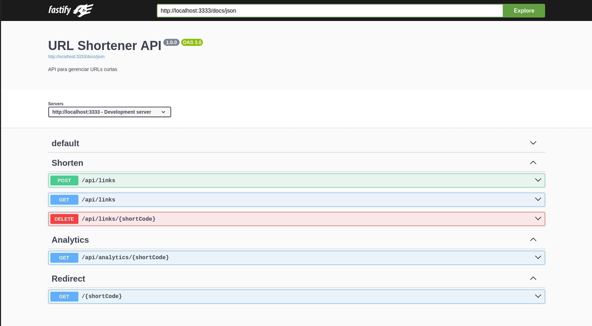

Uma API REST de alta performance para encurtamento de URLs, construída com **Fastify**, **TypeScript** e **PostgreSQL**, seguindo os princípios da Arquitetura Limpa e focada em observabilidade, segurança e escalabilidade.


<figcaption>
Documentação da API Swagger.
</figcaption>

---

## 🎯 Por que criei este projeto?

Sempre gostei de trabalhar com APIs RESTful e havia encurtadores de URL populares como Bitly e TinyURL, mas queria criar a minha própria solução para entender profundamente como esses sistemas funcionam nos bastidores.

O objetivo principal era criar um projeto que demonstrasse competências em:
- **Arquitetura Limpa** – Separação clara de responsabilidades
- **Observabilidade** – Métricas, logs estruturados e tracing
- **Performance** – Cache em memória, indexação otimizada
- **Segurança** – Validação de entrada, rate limiting
- **Containerização** – Docker Compose completo com infraestrutura

Escolhi Fastify por ser 3-4x mais rápido que Express, com suporte nativo a TypeScript e baixo overhead. Para o banco de dados, optei por PostgreSQL com Drizzle ORM pela leveza e performance.

---

## 🧱 Arquitetura do Projeto

A arquitetura segue os princípios da **Clean Architecture**, organizada em camadas distintas:

```
url-shortcut/
├── src/
│   ├── core/                      # Utilitários centrais
│   │   ├── entities/              # Entidades base
│   │   ├── types/                 # Tipos TypeScript
│   │   └── either.ts              # Monad Either
│   │
│   ├── domain/                    # Camada de domínio
│   │   └── urls/
│   │       ├── application/       # Casos de uso
│   │       │   ├── repositories/ # Interfaces de repositório
│   │       │   └── use-cases/     # Operações de negócio
│   │       └── enterprise/        # Entidades
│   │           └── entities/       # Modelos de domínio
│   │
│   ├── infra/                     # Camada de infraestrutura
│   │   ├── cache/                 # Cache em memória
│   │   ├── database/              # Banco de dados
│   │   │   ├── repositories/      # Implementações Drizzle
│   │   │   ├── schema/           # Schemas de tabelas
│   │   │   └── client.ts          # Cliente DB
│   │   ├── env/                   # Configuração de ambiente
│   │   ├── http/                  # Camada HTTP
│   │   │   ├── controllers/      # Manipuladores de requisição
│   │   │   ├── presentersFormatadores de resposta
│   │   │   ├── routes/           # Definições de rotas
│   │   │   └── server.ts         # Ponto de entrada
│   │   ├── logging               # Logger estruturado
│   │   ├── metrics               # Métricas Prometheus
│   │   └── utils/                # Utilitários
│   │
│   └── types/                     # Tipos globais TypeScript
│
├── config/                         # Arquivos de configuração
│   ├── datasources.yml           # Datasources Grafana
│   ├── loki.yml                  # Config Loki
│   ├── prometheus.yml
│   ├── tempo.yml
│   ├── traefik.yml
│   └── otel-collector-config.yml
│
├── test/                          # Testes
│   ├── e2e/                       # Testes end-to-end
│   └── unit/                      # Testes unitários
```

### Decisões Arquiteturais

| Aspecto            | Decisão              | Motivo                                 |
| ------------------ | -------------------- | -------------------------------------- |
| **Framework**      | Fastify 5.x          | Performance 3-4x superior ao Express   |
| **Banco de dados** | PostgreSQL + Drizzle | ACID, JSON, maturidade                 |
| **Cache**          | In-Memory (Map)      | TTL de 5min para URLs frequentes       |
| **Logs**           | JSON estruturado     | Integração com Loki/Grafana            |
| **Proxy**          | Traefik 3.x          | Service discovery, Let's Encrypt      |
| **Observabilidade**| OpenTelemetry        | Vendor-neutral, padrão da indústria   |

<!-- IMG: Diagrama da arquitetura mostrando fluxo de requisição -->

---

## ⚙️ Tecnologias e Ferramentas

### Stack Principal

- **Node.js 22** – Runtime JavaScript
- **TypeScript 5.x** – Tipagem estática completa
- **Fastify 5.x** – Framework web de alta performance
- **PostgreSQL 15+** – Banco de dados relacional

### ORM e Banco de Dados

- **Drizzle ORM** – ORM leve e performático
- **PostgreSQL** – Banco de dados principal

### Infraestrutura

- **Docker** – Containerização
- **Traefik 3.x** – Reverse proxy e load balancer
- **Prometheus** – Coleta de métricas
- **Grafana** – Visualização de métricas
- **Loki** – Agregação de logs
- **Tempo** – Distributed tracing
- **OpenTelemetry** – Tracing vendor-neutral

### Observabilidade

- **Prometheus Client** – Métricas customizadas
- ** Pino** – Logger estruturado JSON
- **OpenTelemetry SDK** – Tracing automático

### Validação e Tipagem

- **Zod** – Validação de schemas
- **TypeScript** – Tipagem de ponta a ponta

---

## 🚀 Funcionalidades

### ✨ Funcionalidades Principais

- **Encurtamento de URLs** – Geração automática de códigos curtos
- **Redirect com Tracking** – Rastreamento de cliques com IP, user-agent, geolocalização
- **Analytics** – Estatísticas de cliques por URL
- **Expiration** – Datas de expiração opcionais
- **Rate Limiting** – Limites de requisição configuráveis

<!-- IMG: Dashboard do Grafana com métricas da API -->
<!--  -->

### 🔧 Funcionalidades de Performance

- **Cache em Memória** – TTL de 5 minutos para URLs acessadas frequentemente
- **Indexação Otimizada** – Índices em short_code e created_at
- **Analytics Assíncrono** – Rastreamento não-bloqueante

### 🔒 Funcionalidades de Segurança

- **Validação de Entrada** – Bloqueio de protocolos perigosos (javascript:, data:)
- **Bloqueio de IPs Privados** – Previne redirecionamento para redes internas
- **Type-safe** – TypeScript de ponta a ponta com Zod

### 📊 Observabilidade

- **Métricas Prometheus** – Duração de requisições, cache hits, cliques
- **Logs Estruturados** – Logs JSON com correlação de requisições
- **Health Checks** – Liveness, readiness e health completo
- **OpenTelemetry** – Suporte a distributed tracing

---

## 🛠️ Desafios Técnicos

### 1. Performance de Redirect

**Problema**: Redirecionamentos precisam ser extremamente rápidos para evitar impacto na experiência do usuário.

**Solução**: Implementei cache em memória com TTL de 5 minutos. O fluxo verifica o cache primeiro, e só vai ao banco se houver cache miss.

```typescript
// Verifica cache primeiro
const cachedUrl = cache.get(shortCode);
if (cachedUrl) {
  metrics.cacheHits.inc();
  return redirect(cachedUrl);
}

// Cache miss - busca no banco
const url = await urlRepository.findByShortCode(shortCode);
if (url) {
  cache.set(shortCode, url.originalUrl, TTL);
}
metrics.cacheMisses.inc();
```

### 2. Analytics Assíncrono

**Problema**: Rastrear cliques não pode adicionar latência ao redirecionamento.

**Solução**: O tracking de analytics é executado de forma assíncrona, sem bloquear a resposta de redirect.

```typescript
// Redirect é retornado imediatamente
// Analytics é trackeado em background
redirectAndTrackUrlUseCase.execute(shortCode, request)
  .then(url => {
    // Retorna redirect imediatamente
    reply.redirect(url.originalUrl);
  })
  .catch(() => {
    // Erro não quebra o redirect
  });

// Analytics é persistido async
trackAnalytics(url.id, {
  ip: request.ip,
  userAgent: request.headers['user-agent'],
  country: geoip.lookup(request.ip)
});
```

### 3. Observabilidade Completa

**Problema**: Como garantir visibilidade completa do sistema em produção?

**Solução**: Stack completo de observabilidade com:
- Métricas customizadas via Prometheus
- Logs estruturados JSON com requestId
- Tracing distribuído com OpenTelemetry
- Dashboards Grafana prontos

```typescript
// Métricas customizadas
const httpDuration = new Histogram({
  name: 'http_request_duration_seconds',
  help: 'Duration of HTTP requests',
  labelNames: ['method', 'route', 'status_code'],
  buckets: [0.005, 0.01, 0.025, 0.05, 0.1, 0.25, 0.5, 1]
});

// Logging estruturado
logger.info({
  message: 'Request completed',
  context: { requestId, method, url, statusCode, duration }
});
```

### 4. Validação de URL

**Problema**: Usuários podem tentar encurtar URLs maliciosas ou IPs privados.

**Solução**: Validação robusta com Zod e checagem de protocolos/IPs privados.

```typescript
const urlSchema = z.string()
  .url()
  .refine(
    (url) => !['javascript:', 'data:', 'vbscript:'].includes(url.protocol),
    { message: 'Invalid protocol' }
  )
  .refine(
    (url) => !isPrivateIP(url),
    { message: 'Private IPs not allowed' }
  );
```

---

## 📚 O que Aprendi

Este projeto foi uma jornada intensa de aprendizado:

### Hard Skills

- **Fastify** – Plugins, hooks, schema validation
- **Drizzle ORM** – Queries, migrations, schema design
- **Clean Architecture** – Separação de camadas, dependency injection
- **Docker Compose** – Multi-container orchestration
- **Observabilidade** – Prometheus, Grafana, Loki, Tempo, OpenTelemetry
- **Rate Limiting** – Implementação customizada

### Soft Skills

- **Planejamento de API** – REST design, status codes
- **Documentação** – Swagger/OpenAPI
- **Performance** – Caching strategies, database indexing
- **Debugging** – Logs estruturados, tracing

---

## 📡 Endpoints da API

```bash
# Criar URL encurtada
POST /api/links
{ "url": "https://example.com/very/long/url" }

# Redirecionar
GET /{shortCode}

# Listar todas as URLs
GET /api/links

# Deletar URL
DELETE /api/links/{shortCode}

# Ver analytics
GET /api/analytics/{shortCode}

# Health checks
GET /health
GET /health/live
GET /health/ready

# Métricas Prometheus
GET /metrics
```

---

## 🧪 Scripts Disponíveis

```bash
# Desenvolvimento
npm run dev              # Inicia servidor em modo desenvolvimento

# Build
npm run build            # Compila TypeScript
npm run start            # Inicia produção

# Testes
npm test                 # Executa todos os testes
npm run test:unit        # Testes unitários
npm run test:e2e         # Testes end-to-end
npm run test:watch      # Testes em modo watch

# Database
npx drizzle-kit push    # Push schema para banco
npx drizzle-kit generate # Gera migrations

# Docker
docker-compose up -d    # Inicia stack completo
docker-compose logs -f  # Ver logs
```

---

## 🔮 Próximos Passos

O projeto ainda tem muito a evoluir. Algumas features planejadas:

- [ ] **Autenticação** – JWT para gerenciamento de URLs
- [ ] **Dashboard Web** – Interface para criar e gerenciar URLs
- [ ] **QR Code** – Geração de QR codes para URLs
- [ ] **URLs customizadas** – Códigos personalizados
- [ ] **Dashboard analytics** – Interface web para ver estatísticas
- [ ] **Cache distribuído** – Redis para ambiente production

---

## 💡 Por que este projeto importa

Este projeto demonstra minha capacidade de:

1. **Construir APIs REST de alta performance** – Fastify, cache, otimizações
2. **Arquitetura Limpa** – Código bem organizado e testável
3. **Observabilidade completa** – Métricas, logs, tracing
4. **Infraestrutura como código** – Docker Compose completo
5. **Boas práticas de segurança** – Validação, rate limiting

URL Shortcut não é apenas um encurtador — é uma prova de conceito de como criar APIs robustas, observáveis e performáticas com Node.js.

<!-- IMG: Demonstração da API em ação com curl -->

---

**Gostou do projeto?** Entre em contato ou contribua no GitHub!

⭐ Star no repositório | 🍴 Fork | 📖 Documentação
